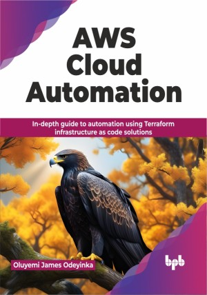

# AWS Cloud Automation

How to automate AWS Cloud using Terraform IaC best practices

This is the repository for [AWS Cloud Automation
](https://bpbonline.com/products/aws-cloud-automation?variant=43145956884680),published by BPB Publications.

## About the Book
AWS Cloud Automation allows organizations to effortlessly organize and handle their cloud resources. Terraform, an open-source provisioning tool, transforms the old manual way of doing things by allowing users to define, deploy, and maintain infrastructure as code, ensuring consistency, scalability, and efficiency. 

This book explains AWS Cloud Automation using Terraform, which is a simple and clear syntax that lets users define the infrastructure needs. Terraform simplifies setting up and managing infrastructure, reducing errors and fostering team collaboration. It enables version control, letting you monitor changes and implement CI/CD pipelines, effortlessly. The book guides you in creating and managing AWS resources through a simple configuration file, allowing you to define virtual machines, networks, databases, and more. Discover how Terraform makes organizing infrastructure code easy, promoting reusability and simple maintenance with consistent patterns across projects and teams.

This book will empower readers of AWS Cloud Automation to embrace a modern, scalable, and efficient approach to managing cloud infrastructure. By combining the power of Terraform with the flexibility of AWS.

## What You Will Learn
• Implement automated workflows with Terraform in CI/CD pipelines, for consistent and reliable deployments.

• Secure your cloud environment with robust Identity and Access Management (IAM) policies.

• Build and deploy highly available and scalable applications using EC2, VPC, and ELB.

• Automate database deployments and backups with RDS and DynamoDB for worry-free data management.

• Implement serverless architectures with EKS and Fargate for agile and cost-effective development.
